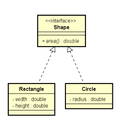

# GenericsCuringasDelimitados1
Curingas delimitados (bounded wildcards)

## Vamos fazer um método para retornar a soma das áreas de uma lista de figuras.

Nota 1: soluções impróprias:
```java
public double totalArea(List<Shape> list)
public double totalArea(List<?> list)
```
Nota 2: não conseguiremos adicionar elementos na lista do método

<p align="center">
    
</p>
